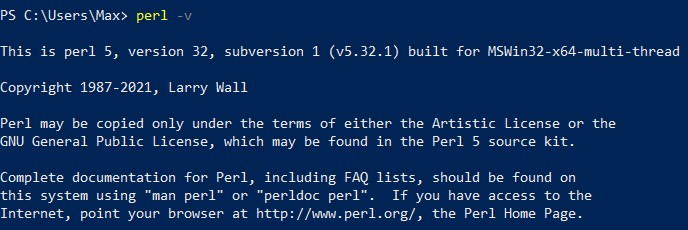
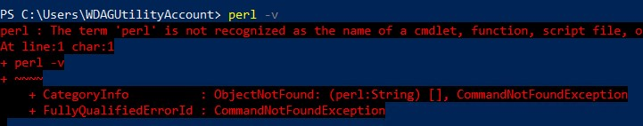
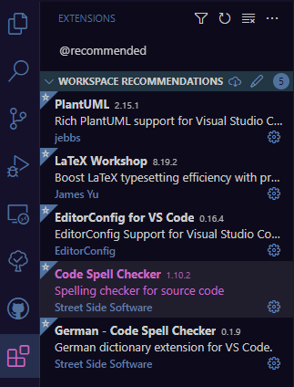
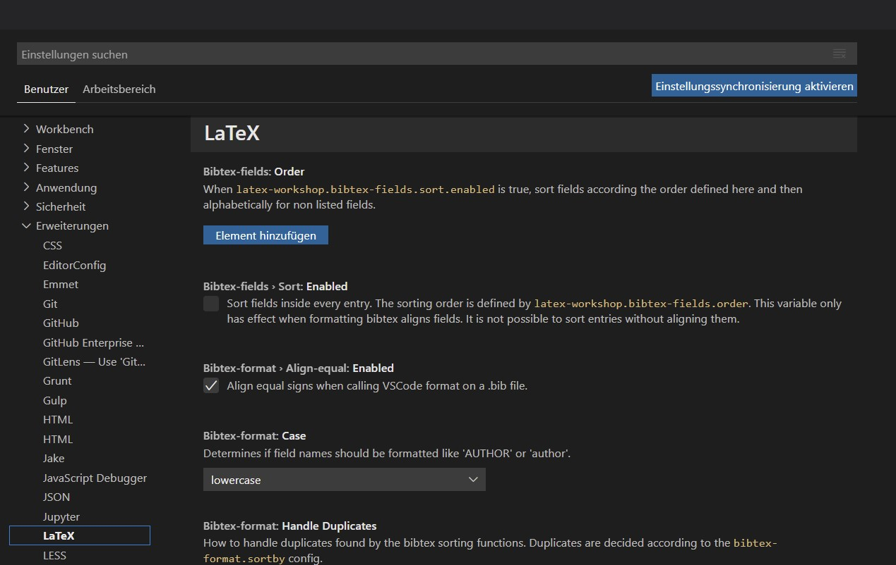
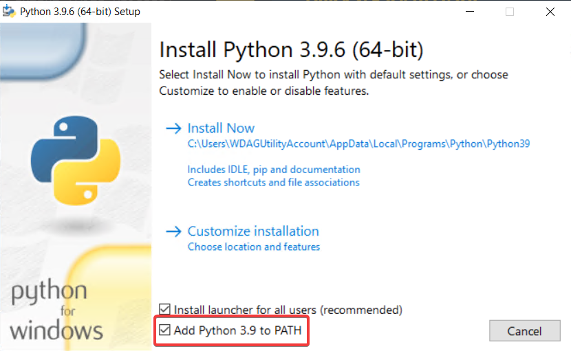

# DHGE-LaTeX [](https://github.com/RvNovae/dhge-latex/actions/workflows/ci-dhge-latex.yaml) <!-- omit in toc -->

Inoffizielles LaTeX-Template für Projektarbeiten für Technik-Studiengänge an der Dualen Hochschule Gera Eisenach

# Inhaltsverzeichnis <!-- omit in toc -->

- [Installation](#installation)
  - [LaTeX Installation](#latex-installation)
    - [Perl](#perl)
  - [Setup](#setup)
    - [Visual Studio Code: empfohlene Erweiterungen](#visual-studio-code-empfohlene-erweiterungen)
    - [Einstellen von TeXstudio zur Nutzung von `latexmk`](#einstellen-von-texstudio-zur-nutzung-von-latexmk)
    - [Einstellen von LaTeX Workshop (VSCode)](#einstellen-von-latex-workshop-vscode)
- [Latex Tipps](#latex-tipps)
  - ["Variablen"](#variablen)
  - [Environment (Umgebung)](#environment-umgebung)
    - [Common Environments](#common-environments)
- [Zitate und Literaturverzeichnis](#zitate-und-literaturverzeichnis)
  - [Zitat als Fußnote einfügen](#zitat-als-fußnote-einfügen)
  - [Hochgestelltes Zitat einfügen](#hochgestelltes-zitat-einfügen)
  - [Tipps](#tipps)
    - [Firma als Autor](#firma-als-autor)
    - [Mehrere Autoren](#mehrere-autoren)
    - [Indirektes Zitat](#indirektes-zitat)
- [Abbildungen](#abbildungen)
  - [LaTeX Abbildungen](#latex-abbildungen)
  - [dhge-latex Abbildungen](#dhge-latex-abbildungen)
- [Abkürzungen](#abkürzungen)
- [Anlagenverzeichnis](#anlagenverzeichnis)
  - [Verwendung](#verwendung)
- [Code mit Minted einfügen](#code-mit-minted-einfügen)
- [Spezielle Abschnitte](#spezielle-abschnitte)
  - [SubSubSubSection](#subsubsubsection)
- [Unicode Alphabete](#unicode-alphabete)

# Installation

## LaTeX Installation
Eine Installation von MikTeX über [proTeXt](https://www.tug.org/protext/) wird empfohlen.
Als Editor bieten sich beispielsweise [Visual Studio Code](https://code.visualstudio.com/) in Kombination mit der [latex-workshop](https://marketplace.visualstudio.com/items?itemName=James-Yu.latex-workshop) Extension oder alternativ [TeXstudio](https://www.texstudio.org/) an.

>Bei einer bereits bestehenden Installation sollten die installierten Packages auf Updates überprüft werden. Andererseits kann es zu Problemen beim Bauen kommen.

### Perl

Möchte man Dokumente mit `latextmk` bauen, was wir im Abschnitt [Setup](#setup) empfehlen, wird eine funktionierende Perl-Installation benötigt.
Nutzer von macOS und Linux haben meistens schon ein vorinstalliertes Perl.

**Überprüfung einer Installation**

Wenn man herausfinden möchte, ob man bereits ein funktionierendes Perl hat oder die unten genannte Installation erfolgreich verlief, kann man in einer Kommandozeile (Terminal) seiner Wahl ``perl -v`` ausführen.
Ist Perl korrekt installiert, wird die Version ausgegeben:



Ist die Perl-Installation nicht vorhanden oder dem Terminal unbekannt, wird stattdessen folgendes ausgegeben:



**Installation unter Windows**

Für Windows Nutzer empfiehlt sich Strawberry Perl, was [hier](https://strawberryperl.com/) erhältlich ist.

## Setup

* Das Repository downloaden, clonen, oder die Template Funktion nutzen, um ein eigenes Repository zu erstellen.
* Mit der Update-Datei (OS abhängig .bat/.sh) kann ein bestehendes Template aktualisiert werden

* ### **ACHTUNG** die Update-Datei (entsprechend OS)
  * **überschreibt** die Dateien im build Ordner
    * eigene Anpassungen sollten über die Dateien im Wurzelverzeichnis des Projektes geschehen
  * **löscht** die mit git in Zusammenhang stehenden Ordner und Dateien (.git, .gitignore, .gitkeep)

Das Projekt sollte sich nun bauen lassen.

Wir empfehlen den `latexmk` Befehl zum Kompilieren des Projekts.
Während die Visual Studio Code Erweiterung "LaTeX Workshop" standardmäßig `latexmk` verwendet, ist bei TeXstudio eine Anpassung der Einstellungen erforderlich, siehe [hier](#einstellen-von-texstudio-zur-nutzung-von-latexmk)

### Visual Studio Code: empfohlene Erweiterungen

Wir empfehlen für die Arbeit in Visual Studio Code ausgewählte Erweiterungen, die sowohl für das Schreiben mit LaTeX, als auch für das Studium an der DHGE<!--ähem Plantuml--> hilfreich sind.
Um sie zu prüfen und ggf. zu installieren, kann in dem Erweiterungsmenü nach `@recommended` gesucht werden:



### Einstellen von TeXstudio zur Nutzung von `latexmk`

1. Die TeXstudio-Einstellungen öffnen: Im Menüband `Optionen`, dann `TeXstudio konfigurieren...` anklicken
2. Im Abschnitt `Befehle` sichergehen, dass der Latexmk-Eintrag befüllt ist, z.B. mit: `latexmk.exe -pdf -silent -synctex=1 %`
3. Im Abschnitt `Erzeugen` den Standardcompiler `Latexmk` in der Drop-down Liste auswählen

### Einstellen von LaTeX Workshop (VSCode)

Die Erweiterung "LaTeX Workshop" für Visual Studio Code bietet eine Vielzahl von Einstellungsmöglichkeiten und kann auf die individuellen Bedürfnisse angepasst werden.
z.B. kann ein externer PDF-Betrachter oder ein automatisches Build-Intervall eingerichtet werden.
Die Einstellungen für die Erweiterung findet man am Ende der Einstellungen von Visual Studio Code selbst:

1. im Menüband `Datei` anklicken
2. über `Einstellungen` hovern und dort `Einstellungen` anklicken.
3. Am Ende der Liste `Erweiterungen` aufklappen und das Kapitel `LaTeX` anklicken.



# Latex Tipps

<!-- todo: add more -->
Ein relativ simples [LaTeX-Tutorial](https://www.latex-tutorial.com/tutorials/first-document/) zum einfachen Einstieg in die Welt von TeX.
> _ist allerdings durch das Template nicht nötig, nachfolgendes sollte ausreichen_

Für einen Einstieg in das wissenschaftliche Schreiben an sich bietet sich ein Artikel von Sebastian Hahner an, der ebenfalls auf LaTeX eingeht: [Wissenschaftliches Schreiben Schnelleinstieg](https://github.com/sebinside/WissenschaftlichesSchreiben-Schnelleinstieg)

## "Variablen"

Variablen gibt es in TeX an sich nicht wie in anderen Sprachen.

```latex
\def\<variablenName>{<variablenWert>}
```

Der `\def` Befehl definiert ein Command der letztendlich Folgendem entspricht:

```latex
\newcommand{\<variablenName>}{<variablenWert>}
```

Richtig werden diese "Variablen" dann durch `\<variablenName>`**`{}`** aufgerufen.

Alternativ ist aber auch möglich, sie durch `\<variablenName>` aufzurufen.\
> Hier ist zu beachten, dass nach der Variable das Leerzeichen fehlen wird, da dieses als Argument des Befehls aufgenommen wird

## Environment (Umgebung)

Ein Codeblock, welcher bestimmte Abläufe vor und nach dem eigenen Code laufen lässt.

```latex
\begin{<environment>}
  <codeAndText>
\end{<environment>}
```

### Common Environments

* [itemize/enumerate](https://en.wikibooks.org/wiki/LaTeX/List_Structures)
* [table/tabular](https://en.wikibooks.org/wiki/LaTeX/Tables)
* [figure](https://en.wikibooks.org/wiki/LaTeX/Floats,_Figures_and_Captions)

# Zitate und Literaturverzeichnis

## Zitat als Fußnote einfügen

Dafür wird der `footcite` Befehl genutzt. Dieser besitzt folgende Syntax:

```latex
\footcite[Postnote]{literatur_id}
```

Beispiel:

```latex
\footcite[S. 42]{mapi}
```

## Hochgestelltes Zitat einfügen

Alternativ kann nun auch der `supercite` Befehl verwendet werden:

```latex
\supercite[Postnote]{literatur_id}
```

Beispiel:

```latex
\supercite[S. 42]{mapi}
```

***

<!-- todo: is this still a thing? the vscode extension does this pretty well without crying -->
**Bei jeder Änderung in `literatur.bib` müssen folgende Schritte durchgeführt werden:**

1. Das Projekt kompilieren (`pdflatex.exe -synctex=1 -interaction=nonstopmode "template".tex`)
2. Biber ausführen (`biber.exe "template"`)
3. Das Projekt 2x kompilieren

***

> Werden die oben genannten Schritte nicht durchgeführt, kommt es zu Darstellungsfehlern bei Zitaten und dem Literaturverzeichnis.

***

## Tipps

### Firma als Autor

Wird als "Autor" eine Firma verwendet, sollten doppelte `{}` in der `literatur.bib` verwendet werden.
Das bewirkt Wunder.

### Mehrere Autoren

Mehrere Autoren können mit `and` verknüpft werden. Beispielsweise: `author={Felix Prillwitz and Oliver Kogel and 谭九鼎}`

### Indirektes Zitat

Wird `\footcite` oder `\supercite` mit beiden optionalen Parametern aufgerufen, so ist die Syntax wie folgt:

```latex
\footcite[Prenote][Postnote]{id}
```

Beispiel:

```latex
\supercite[Vgl.][]{Computerphile.2020}
```

# Abbildungen

- Abbildungen werden durch das Template in `assets/img` gefunden.
  - `\includegraphics{<imgName>}` entspricht `\includegraphics{assets/img/<imgName>}`
  - anpassbar durch `\graphicspath `
    - **`<newImagePath>`** ist aus der sicht von `build/` zu sehen
    - `\graphicspath {{../assets/img/}}}`

## LaTeX Abbildungen

```latex
\begin{figure}[<options>]
  \caption{<captionName>}
  \includegraphics[<imgOptions>]{<imgName>}
  \label{<labelName>}
\end{figure}
```

Beispiel:

```latex
\begin{figure}[H]
  \centering
  \caption{testImgName}
  \includegraphics[scale=0.75]{imgName}
  \label{fig:anlagentest}
\end{figure}
```

- `[H]` - entspricht dem Fixieren an der Stelle im Text
- `[scale=0.75]` - skaliert das Bild auf 75% der Originalgröße
- `fig:anlagentest` - `fig:` oder `tab:` ist ein typischer Anfang von Referenzen für entsprechend `figure` oder `table` Umgebung

## dhge-latex Abbildungen

```latex
\dhgefigure[1]{2}{3}{4}{5}[6][7]
```

kann mit bis zu sechs Argumenten aufgerufen werden:

1. **Optional** Float Position, standardmäßig `h`
1. Relativer Bild-Pfad mit oder ohne Dateiendung (relativ zum `./assets/img` Ordner, kann in `template.tex` angepasst werden)
1. `\includegraphics` Optionen (leer lassen für Standard)
1. Bildunterschrift
1. Label für die Figure/Grafik
1. **Optional:** ID
1. **Optional:** "Postnote", beispielsweise um Seitenzahlen anzugeben

Beispiel:

```latex
\dhgefigure[h]{mapi_outgoing_illustration}{scale=0.75}{Absenden einer MAPI Nachricht}{fig:mapi}[mapi][S. 17ff]
```

***

Wir empfehlen, den Befehl als Snippet im Text-Editor zu hinterlegen.
In Visual Studio Code kann ein Snippet folgendermaßen konfiguriert werden:

1. _CTRL+Shift+P_
2. `Preferences: Configure User Snippets`
3. bereits existierenden LaTeX Snippet File auswählen **oder** `New Global Snippets File...`
4. Snippet einfügen:

```json
"DHGE Figure": {
  "prefix": "dhgefigure",
  "body": "\\dhgefigure[H]{${1:filename}}{scale=${6:1.0}}{${2:Caption}}{fig:${3:label}}[${4:biblatex_id}][${5:Postnote}]",
  "description": "Insert \\dhgefigure"
}
```

# Abkürzungen

```latex
\DeclareAcronym{1}{
  short = {2},
  long = {3}
  }
```

1. ID der Abkürzung, damit wird im Fließtext später referenziert.
2. Die Abkürzung selbst
3. Der ausgeschriebene Begriff

Beispielweise:

```latex
\DeclareAcronym{dhge}{
  short = {DHGE},
  long = {Duale Hochschule Gera-Eisenach}
}
```

Im Fließtext wird dann mit

```latex
\ac{dhge}
```

die Abkürzung aufgerufen.
Dies sind die Pflicht-Argumente. Es gibt weitere Einstellungsmöglichkeiten bei dem Deklarieren von Abkürzungen, die in der unten stehenden Dokumentation nachgelesen werden können. Eine sinnvolle Auswahl davon:

```latex
\DeclareAcronym{1}{
  short = {2},
  long = {3},
  short-plural = {4},
  long-plural = {5},
  alt = {8}
  }
```

ODER

```latex
\DeclareAcronym{1}{
  short = {2},
  long = {3},
  short-plural-form = {6},
  long-plural-form = {7},
  alt = {8}
  }
```

1. ID der Abkürzung, damit wird im Fließtext später referenziert.
2. Die Abkürzung selbst
3. Der ausgeschriebene Begriff
4. Buchstabe oder Silbe, die der Abkürzung im Plural angehangen wird
5. Buchstabe oder Silbe, die dem ausgeschriebenen Wort im Plural angehangen wird
6. Plural-Form der Abkürzung, ersetzt die Abkürzung komplett
7. Plural-Form des Wortes, ersetzt das Wort komplett
8. Alternative zum ausgeschriebenen Wort

Die Angaben 4 bis 8 sind optional.

Die Pluralform lässt sich mit

```latex
\acp{1}
```

aufrufen, die Alternativform mit

```latex
\aca{1}
```

Beispiel:

```latex
\DeclareAcronym{jpg}{
  short = {JPEG},
  long = {Joint Photographic Experts Group},
  short-plural-form = {JPEGs},
  long-plural-form = {Joint Photographic Experts Groups},
  alt = {JPG}
  }
```

ODER

```latex
\DeclareAcronym{jpg}{
  short = {JPEG},
  long = {Joint Photographic Experts Group},
  short-plural = {s},
  long-plural = {s},
  alt = {JPG}
  }
```

Aufruf:

```latex
\ac{jpg} % Normale Form
\acp{jpg} % Plural-Form
\aca{jpg} % Alternativ-Form
```

Das Abkürzungsverzeichnis wird dann automatisch erstellt. Dabei ist zu beachten, dass unter Umständen bis zu vier Kompilierungen notwendig sind, wenn eine Abkürzung hinzugefügt oder entfernt wurde, damit das Verzeichnis korrekt erstellt wird.

***

Für mehr Informationen kann die [Acro Package Documentation](https://mirror.physik.tu-berlin.de/pub/CTAN/macros/latex/contrib/acro/acro-manual.pdf) gelesen werden.

# Anlagenverzeichnis

> wird automatisch generiert

## Verwendung

* Anlagen werden in der anlagen.tex hinterlegt.
  * hierbei ist zu beachten:
    * die Anlage muss sich in einer Umgebung vom Typ `figure` oder `table` befinden
    * die Anlage benötigt eine Beschriftung `\caption{}`
  * ein Label ist für eine automatische Verknüpfung im Anlagenverzeichnis nicht nötig
  * der vorgefertigte Befehl `\dhgefigure`, kann verwendet werden, da dieser beide Anforderungen erfüllt
  * siehe Beispiel `build/tests/anlagen.tex`

Beispiel:

```latex
\begin{table}
    \caption{TestBeschriftung}
    \begin{tabular}{c | c}
        1 & 1 \\
    \end{tabular}
\end{table}
```

# Code mit Minted einfügen

**Hier eine kurze Anleitung für das Minted Package. Damit lässt sich Code mit Syntaxhervorhebung direkt in LaTeX einfügen.**

1. Python [hier](https://www.python.org/) herunterladen und installieren und **sicherstellen, dass Python zur Umgebung (PATH) hinzugefügt ist**



2. Pygments installieren (`pip install Pygments`)
3. `\usepackage {minted}` in `build/package.config.tex` hinzufügen
4. `--shell-escape` flag im Compiler-Aufruf setzen
5. [Minted Kurz-Anleitung](https://www.overleaf.com/learn/latex/Code_Highlighting_with_minted) oder [Minted Documentation](https://ctan.mc1.root.project-creative.net/macros/latex/contrib/minted/minted.pdf) lesen

***

Bei Proxy-Problemen mit pip, kann auch das `Pygments.whl` file runtergeladen und dann mit pip installiert werden.
[Pygments Download](https://pypi.org/project/Pygments/#files)

# Spezielle Abschnitte

## SubSubSubSection

Falls man einen Abschnitt 4. Stufe schreiben möchte, kann das mit

```latex
\dhgeparagraph{}
```

umgesetzt werden.

Beispiel:

```latex
\dhgeparagraph{This is a SubSubSubSection}
```

# Unicode Alphabete

Falls chinesische, japanische o.ä. Alphabete verwendet werden müssen (bspw. bedingt durch Autoren), ist die einfachste Methode, das `CJKutf8` Package zu laden.

Eine Anleitung finden Sie in [diesem Artikel](https://www.overleaf.com/learn/latex/chinese).
